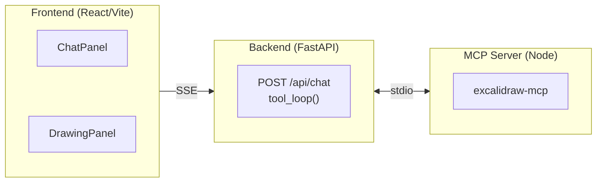
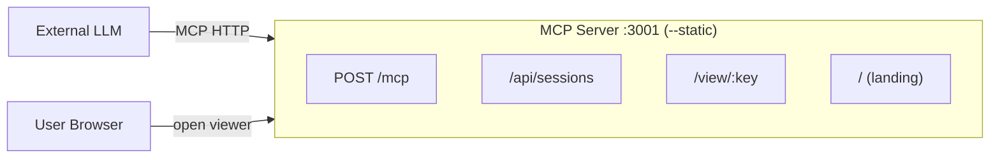

# Interactive Excalidraw Drawer

Interactive Excalidraw Drawer 让 LLM 实时创建和编辑 Excalidraw 图表。支持两种模式：内嵌 LLM 的聊天 UI，以及外部 LLM 通过 MCP HTTP 连接的 sidecar 模式。生产部署请参考 [DEPLOYMENT.md](DEPLOYMENT.md)。

## Architecture

Two usage modes share the same frontend and MCP server:

**Chat mode** — embedded LLM chat with live diagram streaming:



**Sidecar mode** — external LLMs connect via HTTP, single-domain deployment:



- **Frontend** owns conversation state, sends full history per request
- **Backend** is stateless per-request; MCP subprocess is persistent (singleton)
- **API credentials** are stored in localStorage and sent per request

## Quick Start

### Chat Mode (3 terminals)

```bash
# 1. Install
cd excalidraw-mcp && npm install && npm run build && cd ..
cd backend && uv sync --all-extras && cd ..
cd frontend && npm install && cd ..

# 2. Run
# Terminal 1: Backend
cd backend && uv run uvicorn app.main:app --reload --port 8000
# Terminal 2: Frontend dev server
cd frontend && npm run dev
# Terminal 3 is optional — MCP subprocess starts automatically

# 3. Open http://localhost:5173
```

### Sidecar Mode (single domain, single port)

```bash
# 1. Build frontend
cd frontend && npm install && npm run build && cd ..

# 2. Build and start MCP server with --static flag
cd excalidraw-mcp && npm install && npm run build
node dist/index.js --static ../frontend/dist

# → Everything on http://localhost:3001
#   MCP endpoint:  POST /mcp
#   Viewer pages:  /view/:sessionKey
#   Landing page:  /
```

Point your external LLM (Claude Desktop, etc.) to `http://localhost:3001/mcp`. Viewer links returned by the MCP tools will point to the same origin — no separate frontend server needed.

Or use the setup script: `./scripts/setup.sh`

## Usage

### Chat Mode

1. Open `http://localhost:5173`
2. Configure API settings (base URL, API key, model) in the settings modal
3. Describe what you want to draw (e.g., "Draw a flowchart with 3 boxes connected by arrows")
4. The LLM calls excalidraw-mcp tools, and the diagram renders live

### Sidecar Mode

See [excalidraw-mcp/README.md](excalidraw-mcp/README.md) for connecting LLMs, CLI usage, browser viewer, and the Claude Code skill.

## Testing

```bash
# Backend (29 tests)
cd backend && uv run pytest -v

# Frontend (29 tests)
cd frontend && npx vitest run

# E2E (8 tests) — requires frontend dev server
cd e2e && npm install && npx playwright install chromium
cd frontend && npm run dev &
cd e2e && npx playwright test
```
