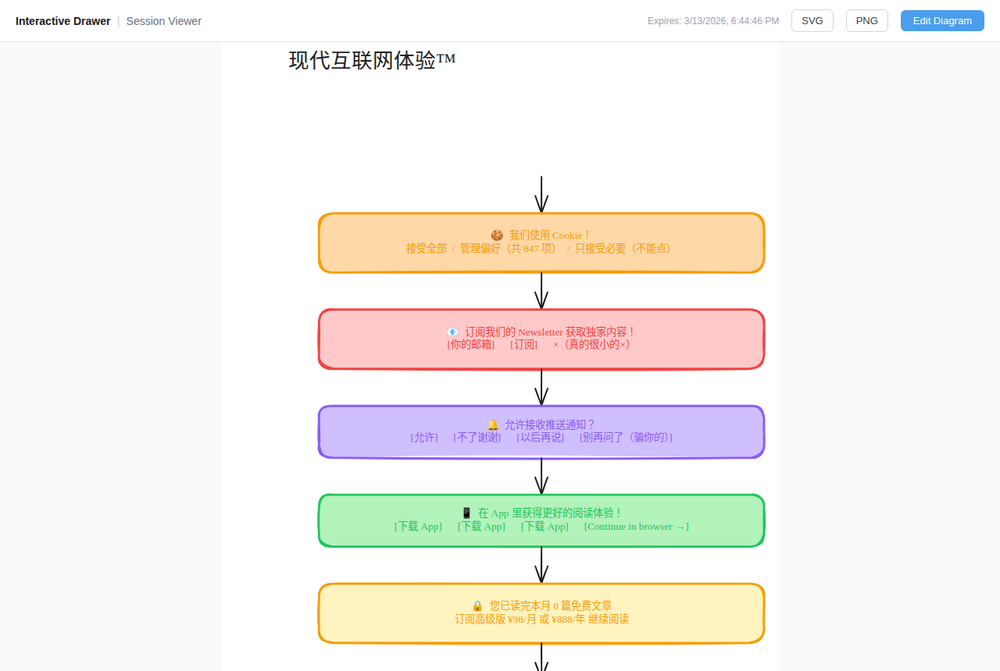

# Interactive Drawer

> Excalidraw MCP server — let any LLM create and share interactive diagrams

[](https://opensource.org/licenses/MIT)
[](https://nodejs.org)
[](https://modelcontextprotocol.io)



---

## What It Does

Interactive Drawer gives LLMs an MCP tool to draw [Excalidraw](https://excalidraw.com) diagrams. The LLM calls `create_view`, a live viewer link is returned, and the user can open, edit, and export the diagram in their browser — no manual drawing required.

Works with **Claude Desktop, Cursor, Goose, Claude Code**, and any MCP-compatible client.

---

## Quick Start

```bash
git clone https://github.com/anyin233/interactive-drawer
cd interactive-drawer

# Build
cd excalidraw-mcp && npm install && npm run build && cd ..
cd frontend && npm install && npm run build && cd ..

# Run
node excalidraw-mcp/dist/index.js --static frontend/dist
# → http://localhost:3001
```

Or use the setup script:

```bash
bash scripts/setup.sh
node excalidraw-mcp/dist/index.js --static frontend/dist
```

---

## Connect Your LLM

### Claude Desktop

```json
{
  "mcpServers": {
    "excalidraw": {
      "url": "http://localhost:3001/mcp"
    }
  }
}
```

### Cursor / Goose / any MCP client

```
http://localhost:3001/mcp
```

### Claude Code / CLI

```bash
echo '{"server":"http://localhost:3001"}' > ~/.excalidraw-mcp.json
node excalidraw-mcp/skill/scripts/mcp-client.mjs create-session
```

---

## MCP Tools

| Tool | Description |
|------|-------------|
| `create_session` | Create a drawing session → returns session key + viewer URL |
| `read_me` | Get the Excalidraw element format reference |
| `create_view` | Render JSON elements → returns viewer URL + SVG |
| `get_current_view` | Fetch latest state (picks up user edits from the browser) |

**Workflow:**
```
create_session → read_me → create_view → share viewer URL → get_current_view → iterate
```

---

## Viewer

Each `/view/:key` link is a full Excalidraw editor:

- Pan (drag), zoom (scroll), edit with full toolbar
- SVG and PNG export
- Edits are saved back to the session (LLM can read them via `get_current_view`)
- Sessions expire after **24 hours**

---

## API Endpoints

| Method | Path | Description |
|--------|------|-------------|
| `POST` | `/mcp` | MCP Streamable HTTP |
| `GET` | `/view/:key` | Browser viewer + editor |
| `GET` | `/api/sessions/:key` | Session metadata |
| `GET` | `/api/sessions/:key/elements` | Raw elements JSON |
| `PUT` | `/api/sessions/:key/elements` | Replace elements |
| `GET` | `/api/sessions/:key/svg` | Rendered SVG |
| `GET` | `/` | Status page |

---

## Configuration

| Variable | Default | Description |
|----------|---------|-------------|
| `PORT` | `3001` | Server port |
| `BASE_URL` | `http://localhost:PORT` | Public URL for viewer links |

```bash
PORT=3001 BASE_URL=https://draw.example.com \
  node excalidraw-mcp/dist/index.js --static frontend/dist
```

---

## Chat UI (Optional)

A built-in React/Python chat interface lets you draw via conversation in the browser.

Requires Python 3.11+ and [uv](https://astral.sh/uv).

```bash
cd backend && uv sync --all-extras
cd frontend && npm install

# 3 terminals:
cd backend  && uv run uvicorn app.main:app --port 8000
cd frontend && npm run dev            # → http://localhost:5173
# MCP subprocess starts automatically from the backend
```

---

## Deployment

<details>
<summary>systemd</summary>

```ini
[Service]
WorkingDirectory=/opt/interactive-drawer
ExecStart=node excalidraw-mcp/dist/index.js --static frontend/dist
Environment=PORT=3001
Environment=BASE_URL=https://draw.example.com
Restart=always
```

</details>

<details>
<summary>Docker</summary>

```bash
docker build -t interactive-drawer .
docker run -d -p 3001:3001 -e BASE_URL=https://draw.example.com interactive-drawer
```

</details>

<details>
<summary>nginx (TLS)</summary>

```nginx
location / {
    proxy_pass http://127.0.0.1:3001;
    proxy_set_header Connection '';
    proxy_buffering off;   # required for SSE / MCP Streamable HTTP
}
```

</details>

---

## License

MIT
